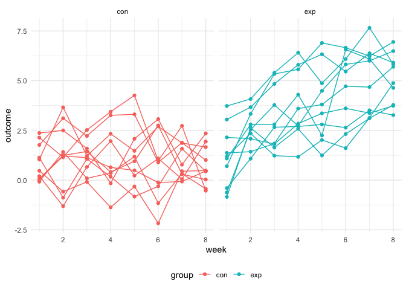
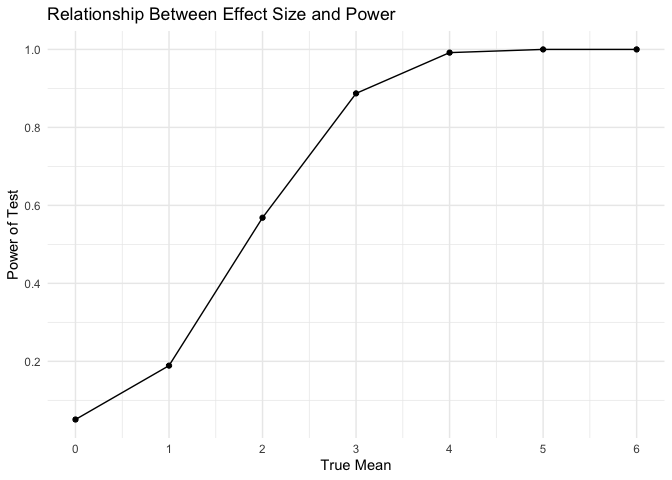
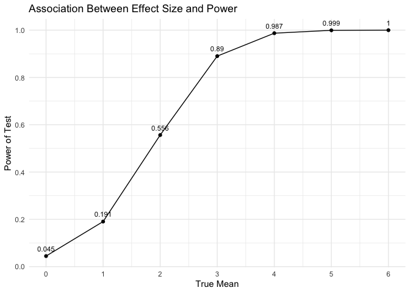
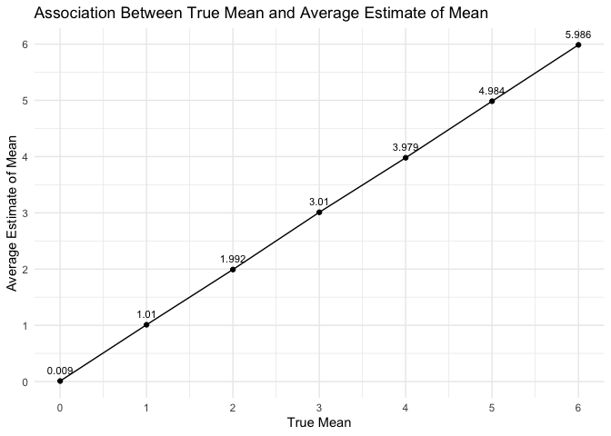
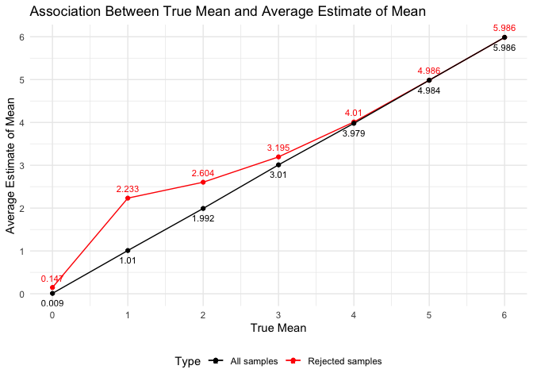

P8105 Homework 5
================
Yifei Xu (yx2638)
2022-11-10

### Problem 1

First import the data in individual spreadsheets contained in
`./data/zip_data/`. A dataframe is created that includes the list of all
files in that directory and the complete path to each file. Next, `map`
over paths and import data using the `read_csv` function. Finally,
`unnest` the result of `map`.

``` r
full_df = 
  tibble(
    files = list.files("data/zip_data/"),
    path = str_c("data/zip_data/", files)
  ) %>% 
  mutate(data = map(path, read_csv)) %>% 
  unnest()
```

Then tidy the dataset using string manipulations on the file, converting
from wide to long, and selecting relevant variables.

``` r
tidy_df = 
  full_df %>% 
  mutate(
    files = str_replace(files, ".csv", ""),
    group = str_sub(files, 1, 3)) %>% 
  pivot_longer(
    week_1:week_8,
    names_to = "week",
    values_to = "outcome",
    names_prefix = "week_") %>% 
  mutate(week = as.numeric(week)) %>% 
  select(group, subj = files, week, outcome)
```

Finally, below is a plot showing individual data, faceted by group.

``` r
tidy_df %>% 
  ggplot(aes(x = week, y = outcome, group = subj, color = group)) + 
  geom_point() + 
  geom_path() + 
  facet_grid(~group)
```

<!-- -->

This plot suggests high within-subject correlation – subjects who start
above average end up above average, and those that start below average
end up below average. Subjects in the control group generally don’t
change over time, but those in the experiment group increase their
outcome in a roughly linear way.

### Problem 2

First, we read the data from the GitHub repository.

``` r
data_url = "https://raw.githubusercontent.com/washingtonpost/data-homicides/master/homicide-data.csv"

homicide = read_csv(url(data_url)) 
```

The raw dataset collects data on homicides in 50 large U.S. cities. It
has 52179 observations of homicides and 12 key variables represent uid,
reported date, victims’ last name, first name, race, age, sex, city,
state, latitude, longitude, and disposition.

Next, we create a `city_state` variable and a `resolved` variable to
indicate whether the homicides were solved. There was one observation
was mis-recorded as “Tulsa, AL” and we plan to drop it since Tulsa is
the city in the state of Oklahoma rather than Alabama.

``` r
homicide_tidy = homicide %>%
  mutate(city_state = str_c(city, state, sep = ", "),
         resolved= case_when(disposition == "Closed by arrest" ~ "solved",
                                disposition == "Closed without arrest" ~ "unsolved",
                                disposition == "Open/No arrest" ~ "unsolved")) %>% 
  select(city_state, everything()) %>%
  filter(city_state != "Tulsa, AL")
```

Then summarize within cities to obtain the total number of homicides and
the number of unsolved homicides.

``` r
city_summary = homicide_tidy %>%
  group_by(city_state) %>%
  summarise(num_homicides = n(),
            num_unsolved_homicides = sum(resolved == "unsolved")) 

city_summary 
```

    ## # A tibble: 50 × 3
    ##    city_state      num_homicides num_unsolved_homicides
    ##    <chr>                   <int>                  <int>
    ##  1 Albuquerque, NM           378                    146
    ##  2 Atlanta, GA               973                    373
    ##  3 Baltimore, MD            2827                   1825
    ##  4 Baton Rouge, LA           424                    196
    ##  5 Birmingham, AL            800                    347
    ##  6 Boston, MA                614                    310
    ##  7 Buffalo, NY               521                    319
    ##  8 Charlotte, NC             687                    206
    ##  9 Chicago, IL              5535                   4073
    ## 10 Cincinnati, OH            694                    309
    ## # … with 40 more rows

Below is the estimation of the proportion of homicides that are unsolved
in Baltimore, MD.

``` r
bal_test = prop.test(
  x = city_summary %>% filter(city_state == "Baltimore, MD") %>% pull(num_unsolved_homicides), 
  n = city_summary %>% filter(city_state == "Baltimore, MD") %>% pull(num_homicides)
  ) 

bal_test %>% broom::tidy()
```

    ## # A tibble: 1 × 8
    ##   estimate statistic  p.value parameter conf.low conf.high method        alter…¹
    ##      <dbl>     <dbl>    <dbl>     <int>    <dbl>     <dbl> <chr>         <chr>  
    ## 1    0.646      239. 6.46e-54         1    0.628     0.663 1-sample pro… two.si…
    ## # … with abbreviated variable name ¹​alternative

``` r
# the estimated proportion
est_prop = bal_test %>% broom::tidy() %>%
  pull(estimate) %>%
  round(digit = 3)

# the confidence interval
conf_low = bal_test %>% broom::tidy() %>%
  pull(conf.low) %>%
  round(digit = 3)

conf_high = bal_test %>% broom::tidy() %>%
  pull(conf.high) %>%
  round(digit = 3)
```

The estimate proportion of unsolved homicides in Baltimore, MD is 0.646
and the confidence interval is \[0.628, 0.663\].

We will run proportion test for each of the cities in the dataset.

``` r
cities_test = 
  city_summary %>% 
  mutate(prop_test = map2(.x = num_unsolved_homicides, .y = num_homicides, ~prop.test(x = .x, n = .y)),
         tidy_test = map(.x = prop_test, ~broom::tidy(.x))) %>% 
  select(city_state, tidy_test) %>% 
  unnest(tidy_test) %>% 
  select(city_state, estimate, conf.low, conf.high)

cities_test
```

    ## # A tibble: 50 × 4
    ##    city_state      estimate conf.low conf.high
    ##    <chr>              <dbl>    <dbl>     <dbl>
    ##  1 Albuquerque, NM    0.386    0.337     0.438
    ##  2 Atlanta, GA        0.383    0.353     0.415
    ##  3 Baltimore, MD      0.646    0.628     0.663
    ##  4 Baton Rouge, LA    0.462    0.414     0.511
    ##  5 Birmingham, AL     0.434    0.399     0.469
    ##  6 Boston, MA         0.505    0.465     0.545
    ##  7 Buffalo, NY        0.612    0.569     0.654
    ##  8 Charlotte, NC      0.300    0.266     0.336
    ##  9 Chicago, IL        0.736    0.724     0.747
    ## 10 Cincinnati, OH     0.445    0.408     0.483
    ## # … with 40 more rows

Below is a plot that shows the estimates and CIs for each city.

``` r
cities_test %>%
  mutate(city_state = fct_reorder(city_state, estimate)) %>%
  ggplot(aes(x = city_state, y = estimate)) +
  geom_point() +
  geom_errorbar(aes(ymin = conf.low, ymax = conf.high)) +
  labs(x = "City",
       y = "Estimate",
       title = "Estimates and Confidence Intervals of Porportion of Unsolved Homicides for Each City") +
  theme(axis.text.x = element_text(angle = 90, vjust = 0.5, hjust=1)) +
  theme(plot.title = element_text(size = 12))
```

<!-- -->

### Problem 3

First create the function to generate normally distributed data and
conduct t-test.

``` r
sim_t_test = function(n = 30, mu, sigma = 5){
  sim_data = tibble(
    x = rnorm(n, mean = mu, sd = sigma)
    ) 
    
  test_data = t.test(sim_data, mu = 0, conf.level = 0.95)
  
  sim_data %>% 
    summarize(
      mu_hat = pull(broom::tidy(test_data), estimate),
      p_val = pull(broom::tidy(test_data), p.value)
    )
}
```

Then generate 5000 datasets from the model $X \sim Normal[\mu, \sigma]$
and repeat t-test

``` r
set.seed(1) 

sim_results_df = 
  tibble(true_mean = c(0:6)) %>% 
  mutate(
    output_lists = map(.x = true_mean, ~rerun(5000, sim_t_test(mu = .x))),
    estimate_dfs = map(output_lists, bind_rows)
    ) %>% 
  select(-output_lists) %>% 
  unnest(estimate_dfs)
```

Below is a plot showing the proportion of times the null is rejected
(the power of the test) on the $y$ axis and the true value of $\mu$ on
the $x$ axis.

``` r
sim_results_df %>%
  group_by(true_mean) %>%
  summarise(
    count = n(),
    rej_num = sum(p_val < 0.05),
    rej_prop = rej_num/count
  ) %>%
  ggplot(aes(x = true_mean, y = rej_prop)) +
  geom_point() +
  geom_line() + 
  geom_text(aes(label = round(rej_prop, 3)), vjust = -1, size = 3) + 
  scale_x_continuous(n.breaks = 10) +
  scale_y_continuous(n.breaks = 6) +
  labs(
    title = "Association Between Effect Size and Power",
    x = "True Mean",
    y = "Power of Test"
  )
```

<!-- -->

From the line plot, we can observe that with the increase of the
difference between true mean and 0 (effect size), the proportion of
times the null is rejected presents a overall increase trend. It
increases sharply at first, and then the increase trend slows down as
the proportion closer to 1??. Generally speaking, there is a positive
association between the effect size and power of the test, which means
the larger the effect size, the greater the power.

Next is a plot showing the average estimate of $\mu$ on the $y$ axis and
the true value of $\mu$ on the $x$ axis.

``` r
sim_results_df %>%
  group_by(true_mean) %>%
  summarise(
    avg_mu_hat = mean(mu_hat)
  ) %>%
  ggplot(aes(x = true_mean, y = avg_mu_hat)) +
  geom_point() +
  geom_line() + 
  geom_text(aes(label = round(avg_mu_hat, 3)), vjust = -1, size = 3) + 
  scale_x_continuous(n.breaks = 6) +
  scale_y_continuous(n.breaks = 6) +
  labs(
    title = "Association Between True Mean and Average Estimate of Mean",
    x = "True Mean",
    y = "Average Estimate of Mean"
  )
```

<!-- -->

We then overlay a second plot on the first to show the average estimate
of $\mu$ only in samples for which the null was rejected on the $y$ axis
and the true value of $\mu$ on the $x$ axis.

``` r
overall_df = sim_results_df %>%
  group_by(true_mean) %>%
  summarise(
    avg_mu_hat = mean(mu_hat)
  ) 

sim_results_df %>%
  filter(p_val < 0.05) %>%
  group_by(true_mean) %>%
  summarise(
    avg_mu_hat = mean(mu_hat)
  ) %>%
  ggplot(aes(x = true_mean, y = avg_mu_hat, color = "Rejected samples")) +
  geom_point() +
  geom_line() + 
  geom_text(aes(label = round(avg_mu_hat, 3)), vjust = -1, size = 3) +
  geom_point(data = overall_df, aes(x = true_mean, y = avg_mu_hat, color = "All samples")) +
  geom_line(data = overall_df, aes(x = true_mean, y = avg_mu_hat, color = "All samples")) +  
  geom_text(data = overall_df, aes(label = round(avg_mu_hat, 3), color = "All samples"), vjust = 2, size = 3) +
  scale_x_continuous(n.breaks = 6) +
  scale_y_continuous(n.breaks = 6) +
  labs(
    title = "Association Between True Mean and Average Estimate of Mean",
    x = "True Mean",
    y = "Average Estimate of Mean",
    color = "Type"
  ) +
  scale_color_manual(values = c("All samples" = "black", "Rejected samples" = "red"))
```

<!-- -->

From plot above, we can observe that the sample average of $\hat{\mu}$
across tests for all samples is approximately equal to the true value of
$\mu$. However, for the sample average of $\hat{\mu}$ across tests for
which the null is rejected, it is approximately equal to the true value
of $\mu$ when $\mu=4,5,6$ while it is different from the true value of
$\mu$ when $\mu=1,2,3$.  
We reject the null hypothesis when the estimate of mean $\hat{\mu}$ is
significantly different from 0. As the true mean gets larger, the effect
size becomes larger accordingly, which leads to a higher probability of
correctly rejecting the null hypothesis. Therefore, when $\mu=4,5,6$
more samples are correctly rejected, approximately equivalent to the
whole samples.
