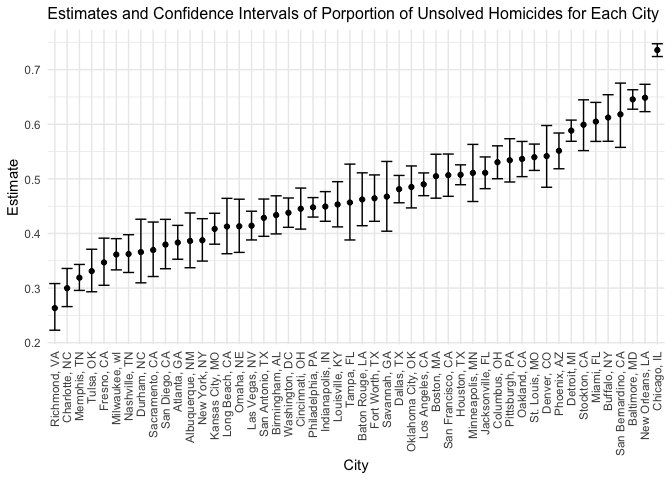

p8105_hw5_yx2638
================
Yifei Xu
2022-11-10

### Problem 2

First, we read the data from the GitHub repository.

``` r
data_url = "https://raw.githubusercontent.com/washingtonpost/data-homicides/master/homicide-data.csv"

homicide = read_csv(url(data_url)) 
```

The raw dataset collects data on homicides in 50 large U.S. cities. It
has 52179 observations of homicides and 12 key variables represent uid,
reported date, victims’ last name, first name, race, age, sex, city,
state, latitude, longitude, and disposition.

Next, we create a city_state variable and a resolved variable to
indicate whether the homicides were solved. There was observation was
misrecorded as “Tulsa, AL” and we plan to drop it since Tulsa is the
city in the state of Oklahoma rather than Alabama.

``` r
homicide_tidy = homicide %>%
  mutate(city_state = str_c(city, state, sep = ", "),
         resolved= case_when(disposition == "Closed by arrest" ~ "solved",
                                disposition == "Closed without arrest" ~ "unsolved",
                                disposition == "Open/No arrest" ~ "unsolved")) %>% 
  select(city_state, everything()) %>%
  filter(city_state != "Tulsa, AL")
```

Then summarize within cities to obtain the total number of homicides and
the number of unsolved homicides.

``` r
city_summary = homicide_tidy %>%
  group_by(city_state) %>%
  summarise(num_homicides = n(),
            num_unsolved_homicides = sum(resolved == "unsolved")) 

city_summary 
```

    ## # A tibble: 50 × 3
    ##    city_state      num_homicides num_unsolved_homicides
    ##    <chr>                   <int>                  <int>
    ##  1 Albuquerque, NM           378                    146
    ##  2 Atlanta, GA               973                    373
    ##  3 Baltimore, MD            2827                   1825
    ##  4 Baton Rouge, LA           424                    196
    ##  5 Birmingham, AL            800                    347
    ##  6 Boston, MA                614                    310
    ##  7 Buffalo, NY               521                    319
    ##  8 Charlotte, NC             687                    206
    ##  9 Chicago, IL              5535                   4073
    ## 10 Cincinnati, OH            694                    309
    ## # … with 40 more rows

Below is the estimation of the proportion of homicides that are unsolved
in Baltimore, MD.

``` r
bal_homicide = homicide_tidy %>%
  filter(city_state == "Baltimore, MD")

bal_summary = bal_homicide %>%
  group_by(city_state) %>%
  summarise(num_homicides = n(),
            num_unsolved_homicides = sum(resolved == "unsolved"),
            prop_unsolved_homicides = num_unsolved_homicides/num_homicides) 

bal_test = prop.test(x = bal_summary %>% pull(num_unsolved_homicides),
                     n = bal_summary %>% pull(num_homicides))

est_prop = bal_test %>% broom::tidy() %>%
  pull(estimate) %>%
  round(digit = 3)

conf_low = bal_test %>% broom::tidy() %>%
  pull(conf.low) %>%
  round(digit = 3)

conf_high = bal_test %>% broom::tidy() %>%
  pull(conf.high) %>%
  round(digit = 3)
```

The estimate proportion of unsolved homicides in Baltimore, MD is 0.646
and the confidence interval is \[0.628, 0.663\].

We will run proportion test for each of the cities in the dataset.

``` r
results_df = 
  city_summary %>% 
  mutate(prop_test = map2(.x = num_unsolved_homicides, .y = num_homicides, ~prop.test(x = .x, n = .y)),
         tidy_test = map(.x = prop_test, ~broom::tidy(.x))) %>% 
  select(city_state, tidy_test) %>% 
  unnest(tidy_test) %>% 
  select(city_state, estimate, conf.low, conf.high)

results_df
```

    ## # A tibble: 50 × 4
    ##    city_state      estimate conf.low conf.high
    ##    <chr>              <dbl>    <dbl>     <dbl>
    ##  1 Albuquerque, NM    0.386    0.337     0.438
    ##  2 Atlanta, GA        0.383    0.353     0.415
    ##  3 Baltimore, MD      0.646    0.628     0.663
    ##  4 Baton Rouge, LA    0.462    0.414     0.511
    ##  5 Birmingham, AL     0.434    0.399     0.469
    ##  6 Boston, MA         0.505    0.465     0.545
    ##  7 Buffalo, NY        0.612    0.569     0.654
    ##  8 Charlotte, NC      0.300    0.266     0.336
    ##  9 Chicago, IL        0.736    0.724     0.747
    ## 10 Cincinnati, OH     0.445    0.408     0.483
    ## # … with 40 more rows

Below is a plot that shows the estimates and CIs for each city.

``` r
results_df %>%
  mutate(city_state = fct_reorder(city_state, estimate)) %>%
  ggplot(aes(x = city_state, y = estimate)) +
  geom_point() +
  geom_errorbar(aes(ymin = conf.low, ymax = conf.high)) +
  labs(x = "City",
       y = "Estimate",
       title = "Estimates and CIs of Porportion of Unsolved Homicides for Each City") +
  theme(axis.text.x = element_text(angle = 90, vjust = 0.5, hjust=1))
```

<!-- -->
